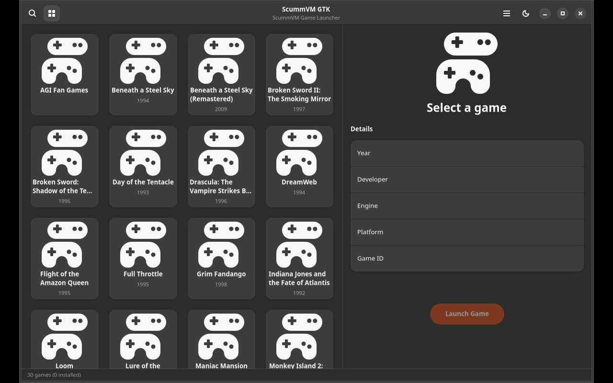

# ScummVM GTK

GTK4/Adwaita frontend for ScummVM — browse, search and launch your ScummVM games with a modern Linux desktop interface.



## Features

- 🎮 Browse 30+ classic ScummVM games in a grid view
- 🔍 Search games by name, engine, or developer
- 📋 Detailed side panel with game info (year, developer, engine, platform)
- 🖼️ Game icons from the official ScummVM icons repository
- 🚀 Launch games directly from the interface
- 🔄 Auto-detect installed ScummVM games
- 🌙 Dark/light theme toggle
- 🌍 Translatable via gettext

## Installation

### From source

```bash
pip install .
scummvm-gtk
```

### Requirements

- Python 3.10+
- GTK4, libadwaita
- PyGObject
- ScummVM (optional, for launching games)

## License

GPL-3.0-or-later

## Author

Daniel Nylander <daniel@danielnylander.se>
